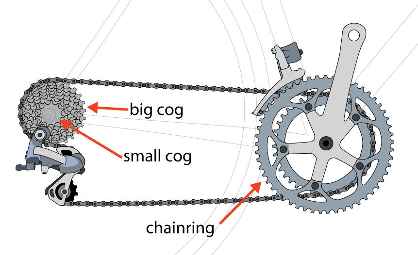

# Designing Classes with a Single Responsibility

The foundation of an object-oriented system is the _message_, but the most visible organizational structure is the _class_. *single responsibility* concentrates on how to decide what belongs in a class. The other principles have more emphasis on the messages.

When creating new code, a lot of questions might arrise. 

* What are the classes to use?
* How many classes should I have?
* What behavior will they implement?
* How much do they know about other classes?
* How much of them selves should they expose?

These questions can be overwhelming. Fear not. The first thing to do is to _insist that it be simple_.
The goal is to model your application, using classes, such that it does what it is supposed to _right now_, and is easy to change _later_.

These are two different criteria. Everyone can arrange code to make it work right now. Creating an easy-to-change application, however is a different matter. The quality of easy changeability reveals the craft of programming. Achieving it takes knowledge, skill and a bit of artistic creativity. _Single responsibility_ is a simple technique that helps to improve the easiness of changeability. You just need to know how to use it.

## Deciding What Belongs in a Class

Having an application in mind, you know what it should do. You may even know how to implement the most interesting things bits of behavior. The problem is not of technical knowledge but of organization. You know how to write the code, but not where to put it.

### Grouping Methods into Classes

In class-based object-oriented programming languages, methods are defined in classes. The classes will affect how you think about your application forever. They define a virtual world that constrains the imagination of everyone that will be using those classes. You are constructing a box that may be difficult to think outside of.

It is important to correctly group methods in classes, but in the early stage of the project, you cannot possibly get it right. You will never know less than what you know right now.
If the application succeeds, many of the decisions you make today will need to be changed later. If the moment comes, the ability to successfully make those changes is determined by the design.

Design is more than the art of preserving changeability than it is the act of achieving perfection.

### Organizing Code to Allow for Easy Changes

The idea of _easy_ is to broad. We need concrete definitions of easiness and specific criteria by which to judge code.

If you define easy to change as: 

* Changes have no unexpected side effects
* Small changes in requirements require correspondingly small changes in code
* Existing code is easy to reuse
* The easiest way to make a change is to add code that in itself is easy to change

Then the code you write should have the following qualities. Code should be:

* **Transparent**: The consequences of change should be obvious in the code that is changing and in distant code that relies upon it.
* **Reasonable**: The cos of any change should be proportional to the benefits the change achieves.
* **Usable**: Existing code should be usable in new and unexpected contexts.
* **Exemplary**: The code itself should encourage those who change it to perpetuate these qualities.

To make code TRUE (Transparent, Reasonable, Usable and Exemplary) is to ensure that each class has a single, well-defined responsibility. 

## Creating Classes That have a Single Responsibility

A class should do the smallest possible useful thing. That is, it should have a single responsibility.

### An Example Application: Bicycles and Gears

Bicycles are wonderfully efficient machines. They use gears to provide humans with a mechanical advantage. When riding a bike you can use different gears, small ones to creep up hills, and big ones to  get back down. Gears work by changing how far a bike travels each time your feet complete one circle with the pedals.



The terms of _small_ and _big_ are not very precise. To compare different gears, bicyclists use the ratio of the numbers of their teeth. Those ratios can be calculated with this simple Ruby script:

```ruby
chainring = 52                    # number of teeth
cog       = 11
ratio     = chainring / cog.to_f
puts ratio                        # -> 4.72727272727273

chainring = 30
cog       = 27
ratio     = chainring / cog.to_f
puts ratio                        # -> 1.11111111111111
```

The gear created by combining a 52-tooth chainring with an 11-tooth cog (a 52×11) has a ratio of 4.73. Each time you push the pedals one time around, the wheels will travel around five times. Whith a 30×27 ratio, every single time the pedals go around, the weels will rotate a little more than once.

Believe it or not, there are people who deeply care about bicycle gearing. You can help them out by writing a Ruby application to calculate gear ratios.

```ruby
class Gear
  attr_reader :chainring, :cog
  def initialize(chainring, cog)
    @chainring = chainring
    @cog       = cog
  end

  def ratio
    chainring / cog.to_f
  end
end

puts Gear.new(52, 11).ratio        # -> 4.72727272727273
puts Gear.new(30, 27).ratio        # -> 1.11111111111111
```

The `Gear` class is simplicity itself. You can create a new `Gear` instance by providing the number of teeth for the chainring and the cog. Each instance implements three methods: `chainring`, `cog` and `ratio`.

You show your Gear calculator to a cyclist friend and she finds it useful but immediately asks for an enhancement. She owns two bicycles. The bicycles have exactly the same gearing but they have different wheel sizes. She would like to also calculate the effect of the difference in wheels.

Bikes with larger wheels travel much farther during each wheel rotation than ones with tiny wheels.

-- image wheel difference --

Cyclists use something called _gear inches_ to compare bicycles that differ in both gearing and wheel size. The formula follows:

```
gear inches = wheel diameter * gear ratio
```
where
```
wheel diameter = rim diameter + twice tire diameter
```

You can change the `Gear` class to add this new behavior:

```ruby 
class Gear
  attr_reader :chainring, :cog, :rim, :tire
  def initialize(chainring, cog, rim, tire)
    @chainring = chainring
    @cog       = cog
    @rim       = rim
    @tire      = tire
  end

  def ratio
    chainring / cog.to_f
  end

  def gear_inches
      # tire goes around rim twice for diameter
    ratio * (rim + (tire * 2))
  end
end

puts Gear.new(52, 11, 26, 1.5).gear_inches
# -> 137.090909090909

puts Gear.new(52, 11, 24, 1.25).gear_inches
# -> 125.272727272727
```

The new `gear_inches` method assumes that rim and tire size are given in inches, which may or may not be correct. With that caveat, the `Gear` class meets the specification, and the code, with the exception of the following bug, works.

```ruby
puts Gear.new(52, 11).ratio # didn't this used to work?
# ArgumentError: wrong number of arguments (2 for 4)
#	 from (irb):20:in `initialize'
#	 from (irb):20:in `new'
#	 from (irb):20
```

The bug above was introduced when the `gear_inches` method was added. `Gear.initialize` was changed to require two additional arguments, `rim` and `tire`. Altering the number of arguments of a method breaks all existing callers of the method. This would normally be terrible problem that would have to dealt with instantly. Our application currently has no such callers, so we will ignore it for now.

Now that our `Gear` class exists, its time to ask the question: **Is it the best way to organize the code?**

The answer, as always, is: it depends. If you expect the application to remain static forever, the `Gear` in its current form may be good enough. However you can foresee the possibility of an entire application of calculators for bicyclists. `Gear` is the first of many classes of an application that will _evolve_. To efficiently evolve, code mush be easy to change.

### Why Single Responsibility Matters

Applications that are easy to change consist out of classes that are easy to reuse. Reusable classes are pluggable units of well-defined behavior that have few entanglements.

A class with more than one responsibility is difficult to reuse. If you want to reuse some (but not all) of its behavior, it is impossible to get at only the parts you need. You are faced with two options and neither is appealing:

* If the responsibilities are so coupled that you cannot use just the behavior you need, you could duplicate the code of interest. This is a terrible idea, and would make the code not DRY.
* If the class is structured such that you _can_ access only the behavior you need, you could reuse the entire class. This just substitutes one problem for another.

The class you are reusing is confused about what it does and it contains several tangled up responsibilities, it has _many reasons to change_. It may change for a reason that is unrelated to your use of it. Each time it changes, there is a possibility of breaking every class that depends on it.

You increase the application's chance of breaking unexpectedly if you depend on classes that do to much.

### Determining If a Class Has a Single Responsibility

To determine if a class has behavior that belongs somewhere else is to interrogate it. Rephrasing every one of the methods as a question and it must make sense. For example:

> "Please Mr. Gear, what is your ratio?"

This makes perfectly sense.

> "Please Mr. Gear, what are your gear_inches?"

This might sound weird, but is still doable.

> "Please Mr. Gear, what is your tire (size)?"

This sounds downright ridiculous.

On other way to explore what a class is actually doing is to attempt to describe it in one sentence. If it uses the word "and", it likely has more than one responsibility. If it uses the word "or" the class has more than one responsibility, and they aren't even related.

Object-oriented designers use the word _cohesion_ to describe the concept. The Single Responsibility Principle (SRP) does not require that a class does only one very narrow thing or that it changes for only a single nitpicky reason. SRP instead requires that a class is cohesive. Everything the class does must be highly related to its purpose.

The responsibility of the `Gear` class could be described as "Calculate the ratio between two toothed sprockets". This means that the class, in its current shape does too much. Maybe it could be described as "Calculate the effect that a gear has on a bicyle". This takes `gear_inches` back on solid ground, but `tire` size is still quite shaky.

The class does not feel right. `Gear` has more than one responsibility but it's not obvious what should be done.

### Determining When to Make Design Decisions

The code in the `Gear` class is both _transparant_ and _reasonable_, but this does not reflect excellent design. The class  just has no dependencies so changes have no consequences. If it were to acquire dependencies it would suddenly be a violation of both these goals. The class should be reorganized _at that time_. New dependencies will supply the information you need to make good design decisions.

`Gear` is neither _usable_ nor _exemplary_. It has multiple responsibilities and should not be reused. Other developers might reuse `Gear`, or create new code that follows it pattern while you are waiting for better information.

It is always a question about "improving it now" versus "improving it later". Each choice has a price. A good designer understands this tension and minimizes costs by making informed tradeoffs between the needs of the present and the posibilities of the fututure.

## Writing Code That Embraces Change

You can arrange the code so that `Gear` will be easy to change even if you don't know what changes will come. There are well-known techniques that you can use to create code that embraces change.

### Depend on Behavior, Not Data

Behavior is captured in methods and invoked by sending messages. DRY (Don't Repeat Yourself) code tolerates change because any change in behavior can be made by changing code in just one place.

Objects often contain data. Data is held in an instance variable and can be anything. Data can be accessed in two ways:

* Refer directly to the instance variable
* Wrap the instance variable in an accessor method


#### Hide Instance Variables

> Always wrap instance variables in an accessor method instead of directly referring to a variable

Take a look at the `ratio` method below:

```ruby
class Gear
  def initialize(chainring, cog)
    @chainring = chainring
    @cog       = cog
  end

  def ratio
    @chainring / @cog.to_f      # <-- road to ruin
  end
end
```

Hide the variables, even from the class that defines them by wrapping them in methods.

Ruby provides `attr_reader` as an easy way to create the encapsulating methods:

```ruby
class Gear
  attr_reader :chainring, :cog  # <-------
  def initialize(chainring, cog)
    @chainring = chainring
    @cog       = cog
  end

  def ratio
    chainring / cog.to_f        # <-------
  end
end
```

`attr_reader` causes Ruby to create a simple wrapper method for the variables. Ruby implicitly created one for `cog`:

```ruby
  # default implementation via attr_reader
  def cog
    @cog
  end
```

The `cog` method is now the only place in the code that understands what cog means. _Cog_ becomes the result of a message. Implementing this method changes cog from data (which is refered all over) to behavior (which is defined once).

If the `@cog` instance variable is reffered to ten times and it suddenly needs to be adjusted, the code will need many changes. However if `@cog` is wrapped in a method, you can change cog means by implementing your own version of the method.

Some examples: 

```ruby
  # a simple reimplementation of cog
  def cog
    @cog * unanticipated_adjustment_factor
  end
```

```ruby
  # a more complex one
  def cog
    @cog * (foo? ? bar_adjustment : baz_adjustment)
  end
```
#### Hide Data Structures

If being attached to an instance variable is bad, depending on a complicated data structure is worse. Concider the following `ObscuringReferences` class:

```ruby
class ObscuringReferences
  attr_reader :data
  def initialize(data)
    @data = data
  end

  def diameters
    # 0 is rim, 1 is tire
    data.collect {|cell|
      cell[0] + (cell[1] * 2)}
  end
  # ... many other methods that index into the array
end
```

This class expects to be initialized with a two-dimensional array of rimms and tires:

```ruby
# rim and tire sizes (now in milimeters!) in a 2d array
@data = [[622, 20], [622, 23], [559, 30], [559, 40]]
```

`ObscuringReferences` uses Ruby's `attr_reader` to wrap the `@data` instance in a method. Just hiding the instance variable is not enough. Every sender of `data` must have a complete knowledge of what piece of data is at which index in the array.

The `diameters` method knows not only how to calculate the diameters, but also where to find the rims and tires in the array. It knows that rims are at [0] and tires are at [1]. It depends on the structure of the array. If that structure changes, the code must change aswel.

Referencing rims and tires in this way escapes encapsulation. Befor you know it you reference them all over places. Referencing rims and tires in this way is not DRY. The knowledge that rims are at [0] should not be duplicated. It should be known in just one place.

In Ruby it is easy to separarate structure from meaning. Ruby provides the `Struct` class to wrap a structur. In the following example `RevealingReferences` has the same interface as the previous class.

```ruby
class RevealingReferences
  attr_reader :wheels
  def initialize(data)
    @wheels = wheelify(data)
  end

  def diameters
    wheels.collect {|wheel|
      wheel.rim + (wheel.tire * 2)}
  end
  # ... now everyone can send rim/tire to wheel

  Wheel = Struct.new(:rim, :tire)
  def wheelify(data)
    data.collect {|cell|
      Wheel.new(cell[0], cell[1])}
  end
end
```

The `diameters` has no knowledge of the internal structure of the array. Whate were once references to cell[1] have been transformed into messages send to `wheel.tire`.

All the knowledge about the structure of the incomming array has been isolated inside the `weelify` method, which converts the array of `Arrays` into an array of `Structs`. Ruby defines a `Struct` as "a convenient way to bundle a number of attributes together, using accessor methods, without having to write a explicit class". ([ruby-doc.org/core/classes/Struct.html](http://ruby-doc.org/core/classes/Struct.html))

If the input of the `wheelify` method changes, the code will only change in one place.

This style of code allows you to protect agains changes in externally owned data structures. It makes code more readable and intention revealing. It trades indexing into a structure for sending messages to an object. The `wheelify` method isolates messy structural information and DRYs out code. It makes this class far more tolerant of change.

### Enforce Single Responsibility Everywhere

Creating classes with a single responsibility has important implications for design, but it can be usefully employed in many other parts of the code.

#### Extract Extra Responibilities from Methods

Methods, like classes, should have a single responsibility. All of the same reasons apply. It makes them easy to change and easy to reuse.

Take a look again at the `diameters` method of the `RevealingReferences` class:

```ruby
  def diameters
    wheels.collect {|wheel|
      wheel.rim + (wheel.tire * 2)}
  end
```
The method has clearly two responsibilities. It iterates over the wheels and it calculates the diameter of each wheel. Those responsibilities could be refactered into separate methods:

```ruby
  # first - iterate over the array
  def diameters
    wheels.collect {|wheel| diameter(wheel)}
  end

  # second - calculate diameter of ONE wheel
  def diameter(wheel)
    wheel.rim + (wheel.tire * 2)
  end
```

This refactoring is not a case of overdesign. It only reorganizes code that is currently in use. The fact that the singular `diameter` method can now be called from other places is a free and happy side effect.

Separating iteration from the action is a common case of multiple responsibility that is easy to recogize. In other cases the problem is not so obvious. Lets take a look at the `gear_inches` mehtod of the `Gear` class again:

```ruby
  def gear_inches
      # tire goes around rim twice for diameter
    ratio * (rim + (tire * 2))
  end
```

Is `gear_inches` a responsibility of the `Gear` class? It might be, but it feels wrong to assume so. The root problem is that the method _itself_ has more than one responsibility. Hidden in the `gear_inches` is the calculation for wheel diameter. Extracting this calculation in its own method `diameter` will make it easier to examine the class's responsibilities.

```ruby
  def gear_inches
    ratio * diameter
  end

  def diameter
    rim + (tire * 2)
  end
```

The refactoring does not change the way how the diameter is calculated, it only isolates the behavior in a separate method.

Do these refactorings even when you do not know the ultimate design. They are needed, not because design is clear, but because it isen't. Good practices reveal design.

The refactoring makes the problem obvious. `Gear` is definitely responsible for calculating `gear_inches`but should not be calculating wheel diameter.

The impact of a single refactoring like this is small, but the cumulative effect of this coding style is huge. Methods with a single responsibility have folling benefits:

* **Expose previously hidden qualities**. Refactoring a class so that all of its methods have a single responsibility has a clarifying effect on the class. Even if you do not intend to reorganize the methods into other classes today, having each of them serve a single purpose makes the set of things the class does more obvious.
* **Avoid the need for comments**. Comments can become out of date because they are not executable. Comments are decaying documentation. If code needs a comment, extract that bit into a separate method. The new method will serve the same purpose the old comment did.
* **Encourage reuse**. Small objects encourage coding behavior that is healty for the application. Other programmers will resulse methods instead of duplicating them. They will follow the pattern in turn.
* **Are easy to move to another class**. When design comes more clear and decide to make changes, small methods are easy to move. Small methods lower the barrier to improve design.

#### Isolate Extra Responsibilities in Classes

Once every method has a single responsibility, the scope of the class becomes more apparent. The `Gear` class has some wheel-like behavior. Does the application need a `Wheel` class?

Ruby allows you to remove the responsibility for calculating tire diameter from `Gear` without commiting to a new class. The following example extends the previous `Wheel Struct` with a block that adds a method to calculate diameter. 

```ruby
class Gear
  attr_reader :chainring, :cog, :wheel
  def initialize(chainring, cog, rim, tire)
    @chainring = chainring
    @cog       = cog
    @wheel     = Wheel.new(rim, tire)
  end

  def ratio
    chainring / cog.to_f
  end

  def gear_inches
    ratio * wheel.diameter
  end

  Wheel = Struct.new(:rim, :tire) do
    def diameter
      rim + (tire * 2)
    end
  end
end
```

Now that we have a `Wheel` that can calculate its own diameter. Embedding this `Wheel` in `Gear` is obviously not the long-term design goal. It is more an experiment in code organization. It cleans up `Gear` but defers the decision about `Wheel`.

With this experiment `Gear` suggests a `Wheel` will only exist in the context of a `Gear`.

## Finally, the Real Wheel

You show the application again to your cyclist friend, and the future arrives. She would like to have a calculator for "bicycle wheel circumference". This is the information you have been waiting for. The new feature supplies the exact information you need to make the next design decision.

It is a minor change to the `Wheel` by adding the circumference calculator method. The real change is that there is now an explicite need for a `Wheel` class. Wheel circumferences have nothing to do with gears, to this asks for a new class to be introduced (to keep responsibilities separated).

Because the `Wheel` behavior was already isolated in the `Gear` class, the change is painless. Simply convert the `Wheel Struct` to an independent `Wheel` class and add the `circumference` method:

```ruby
class Gear
  attr_reader :chainring, :cog, :wheel
  def initialize(chainring, cog, wheel=nil)
    @chainring = chainring
    @cog       = cog
    @wheel     = wheel
  end

  def ratio
    chainring / cog.to_f
  end

  def gear_inches
    ratio * wheel.diameter
  end
end

class Wheel
  attr_reader :rim, :tire

  def initialize(rim, tire)
    @rim       = rim
    @tire      = tire
  end

  def diameter
    rim + (tire * 2)
  end

  def circumference
    diameter * Math::PI
  end
end

@wheel = Wheel.new(26, 1.5)
puts @wheel.circumference
# -> 91.106186954104

puts Gear.new(52, 11, @wheel).gear_inches
# -> 137.090909090909

puts Gear.new(52, 11).ratio
# -> 4.72727272727273
```

## Summary

The path to changeable and maintainable object-oriented software begins with classes with a single responsibility. Classes that do one thing _isolate_ that thing from the rest of the application. This allows for change without consequence and reuse without duplication.


