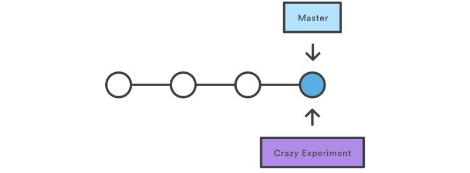
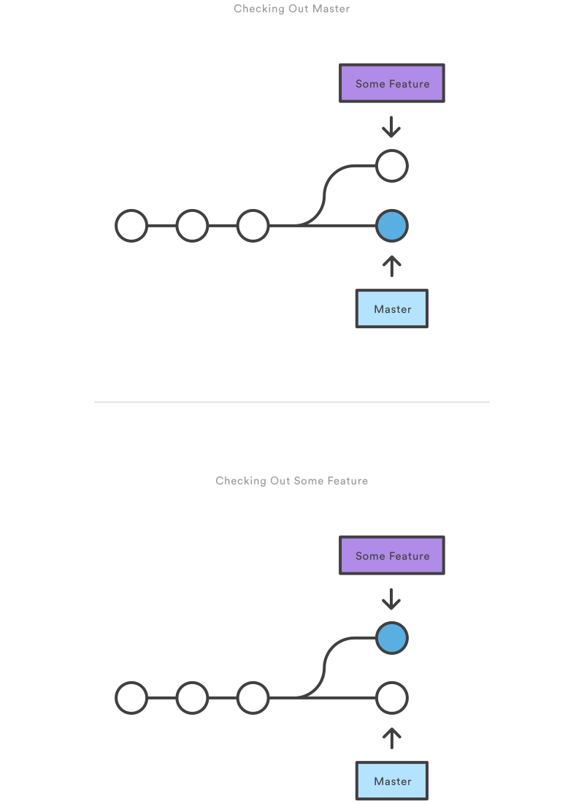
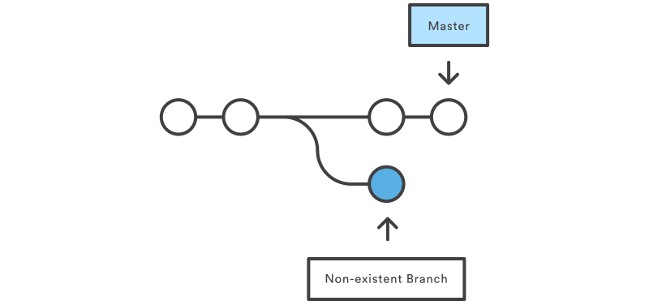

# Using branches

This tutorial is a comprehensive introduction to Git branches. First, we'll take a look at creating branches, which is like requesting a new project history. Then, we'll see how git checkout can be used to select a branch. Finally, we'll learn how git merge can integrate the history of independent branches.

As you read, remember that Git branches aren't like SVN branches. Whereas SVN branches are only used to capture the occasional large-scale development effort, Git branches are an integral part of your everyday workflow.

## git branch

A branch represents an independent line of development. Branches serve as an abstraction for the edit/stage/commit process discussed in Git Basics, the first module of this series. You can think of them as a way to request a brand new working directory, staging area, and project history. New commits are recorded in the history for the current branch, which results in a fork in the history of the project.

The `git branch` command lets you create, list, rename, and delete branches. It doesn’t let you switch between branches or put a forked history back together again. For this reason, `git branch` is tightly integrated with the `git checkout` and `git merge` commands.

### Usage

```
git branch
```

List all of the branches in your repository.

```
git branch <branch>
```

Create a new branch called `<branch>`. This does not check out the new branch.

```
git branch -d <branch>
```

Delete the specified branch. This is a “safe” operation in that Git prevents you from deleting the branch if it has unmerged changes.

```
git branch -D <branch>
```

Force delete the specified branch, even if it has unmerged changes. This is the command to use if you want to permanently throw away all of the commits associated with a particular line of development.

```
git branch -m <branch>
```

Rename the current branch to `<branch>`.

### Discussion

In Git, branches are a part of your everyday development process. When you want to add a new feature or fix a bug—no matter how big or how small—you spawn a new branch to encapsulate your changes. This makes sure that unstable code is never committed to the main code base, and it gives you the chance to clean up your feature’s history before merging it into the main branch.


For example, the diagram above visualizes a repository with two isolated lines of development, one for a little feature, and one for a longer-running feature. By developing them in branches, it’s not only possible to work on both of them in parallel, but it also keeps the main `master branch` free from questionable code.

#### Branch Tips

The implementation behind Git branches is much more lightweight than SVN’s model. Instead of copying files from directory to directory, Git stores a branch as a reference to a commit. In this sense, a branch represents the tip of a series of commits—it's not a container for commits. The history for a branch is extrapolated through the commit relationships.

This has a dramatic impact on Git's merging model. Whereas merges in SVN are done on a file-basis, Git lets you work on the more abstract level of commits. You can actually see merges in the project history as a joining of two independent commit histories.

### Example

Creating Branches
It's important to understand that branches are just *pointers* to commits. When you create a branch, all Git needs to do is create a new pointer—it doesn’t change the repository in any other way. So, if you start with a repository that looks like this:


Then, you create a branch using the following command:

```
git branch crazy-experiment
```

The repository history remains unchanged. All you get is a new pointer to the current commit:



Note that this only creates the new branch. To start adding commits to it, you need to select it with `git checkout`, and then use the standard `git add` and `git commit` commands. Please see the `git checkout` section of this module for more information.

#### Deleting Branches

Once you’ve finished working on a branch and have merged it into the main code base, you’re free to delete the branch without losing any history:

```
git branch -d crazy-experiment
```

However, if the branch hasn’t been merged, the above command will output an error message:

```
error: The branch 'crazy-experiment' is not fully merged.
If you are sure you want to delete it, run 'git branch -D crazy-experiment'.
```

This protects you from losing your reference to those commits, which means you would effectively lose access to that entire line of development. If you really want to delete the branch (e.g., it’s a failed experiment), you can use the capital `-D` flag:

```
git branch -D crazy-experiment
```

This deletes the branch regardless of its status and without warnings, so use it judiciously.

## git checkout

The `git checkout` command lets you navigate between the branches created by `git branch`. Checking out a branch updates the files in the working directory to match the version stored in that branch, and it tells Git to record all new commits on that branch. Think of it as a way to select which line of development you’re working on.

In the previous module, we saw how `git checkout` can be used to view old commits. Checking out branches is similar in that the working directory is updated to match the selected branch/revision; however, new changes are saved in the project history—that is, it’s not a read-only operation.

### Usage

```
git checkout <existing-branch>
```

Check out the specified branch, which should have already been created with `git branch`. This makes `<existing-branch>` the current branch, and updates the working directory to match.

```
git checkout -b <new-branch>
```

Create and check out `<new-branch>`. The `-b` option is a convenience flag that tells Git to run `git branch <new-branch>` before running `git checkout <new-branch>`. `git checkout -b <new-branch> <existing-branch>`

Same as the above invocation, but base the new branch off of `<existing-branch>` instead of the current branch.

### Discussion

`git checkout` works hand-in-hand with `git branch`. When you want to start a new feature, you create a branch with `git branch`, then check it out with `git checkout`. You can work on multiple features in a single repository by switching between them with `git checkout`.



Having a dedicated branch for each new feature is a dramatic shift from the traditional SVN workflow. It makes it ridiculously easy to try new experiments without the fear of destroying existing functionality, and it makes it possible to work on many unrelated features at the same time. In addition, branches also facilitate several collaborative workflows.

#### Detached HEADs
Now that we’ve seen the three main uses of `git checkout` we can talk about that “detached `HEAD`” we encountered in the previous module.

Remember that the `HEAD` is Git’s way of referring to the current snapshot. Internally, the `git checkout` command simply updates the `HEAD` to point to either the specified branch or commit. When it points to a branch, Git doesn't complain, but when you check out a commit, it switches into a “detached `HEAD`” state.


This is a warning telling you that everything you’re doing is “detached” from the rest of your project’s development. If you were to start developing a feature while in a detached `HEAD` state, there would be no branch allowing you to get back to it. When you inevitably check out another branch (e.g., to merge your feature in), there would be no way to reference your feature:



The point is, your development should always take place on a branch—never on a detached `HEAD`. This makes sure you always have a reference to your new commits. However, if you’re just looking at an old commit, it doesn’t really matter if you’re in a detached `HEAD` state or not.

### Example
The following example demonstrates the basic Git branching process. When you want to start working on a new feature, you create a dedicated branch and switch into it:

```
git branch new-feature
git checkout new-feature
```

Then, you can commit new snapshots just like we’ve seen in previous modules:

```
# Edit some files
git add <file>
git commit -m "Started work on a new feature"
# Repeat
```

All of these are recorded in `new-feature`, which is completely isolated from `master`. You can add as many commits here as necessary without worrying about what’s going on in the rest of your branches. When it’s time to get back to “official” code base, simply check out the `master` branch:

```
git checkout master
```

This shows you the state of the repository before you started your feature. From here, you have the option to merge in the completed feature, branch off a brand new, unrelated feature, or do some work with the stable version of your project.


