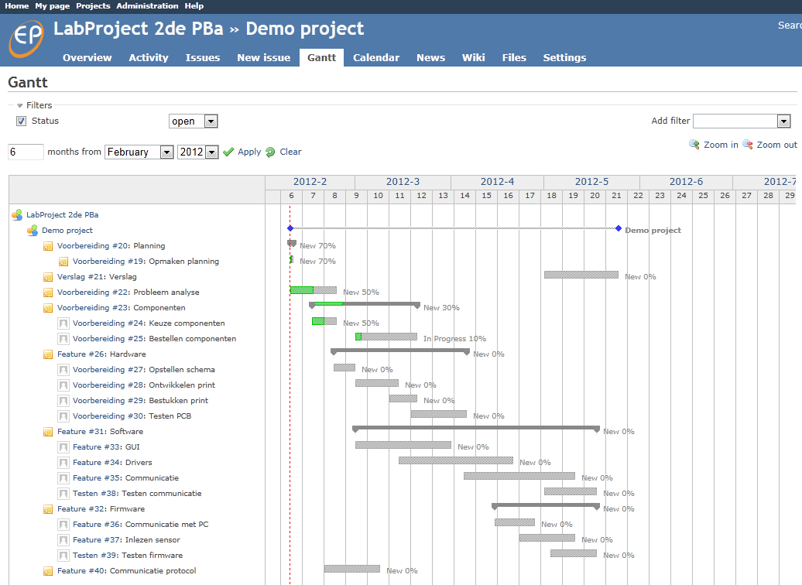
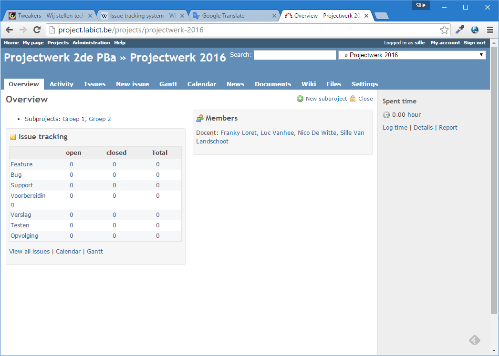
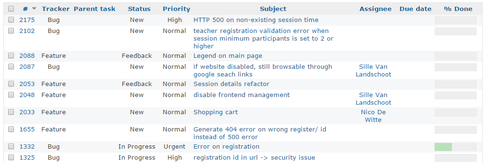
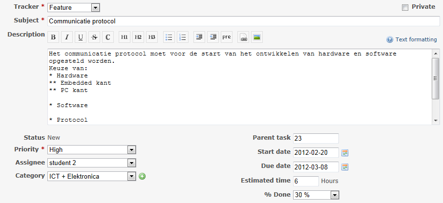
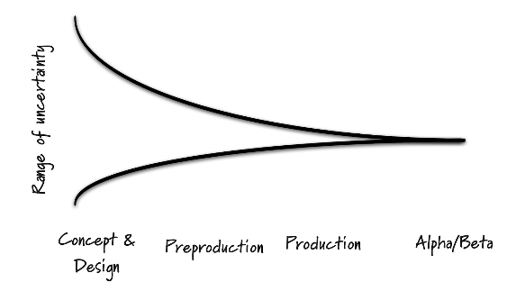
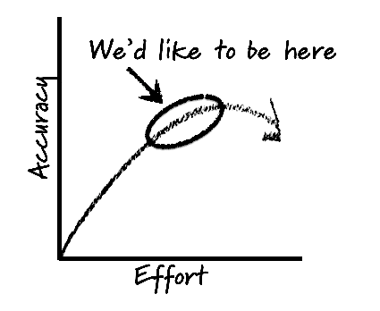
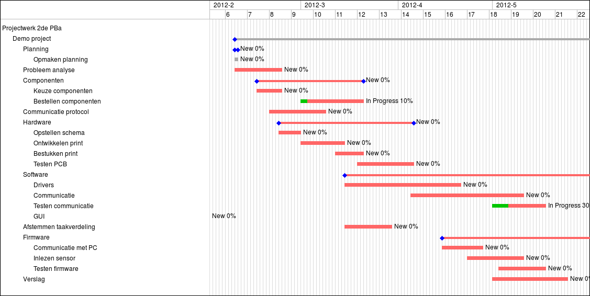
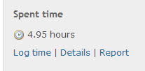
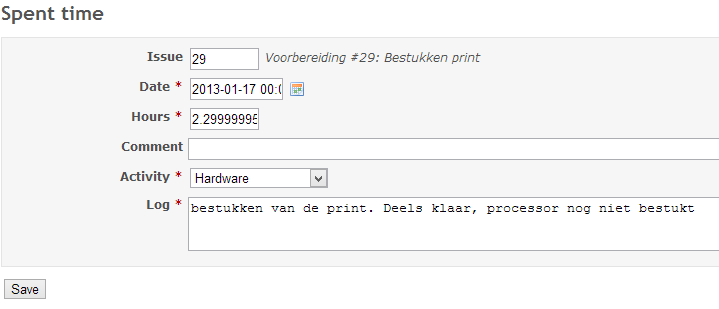

# <!-- fit --> Project Management

With Redmine

---

# Overview

- Introduction
- Issue tracking
- Planning
- Logbook
- Wiki
- Files

---

# Project Management

> Project management is the discipline of **planning**, **organizing**, **securing**, and **managing resources** to **achieve** specific **goals**.
>
> www.wikipedia.org

---

# Redmine

> Redmine is a flexible project management web application. Written using Ruby on Rails framework, it is cross-platform and cross-database.
>
> www.redmine.org

---

# Redmine Features

- Multiple projects support
- Flexible role based access control
- Flexible issue tracking system
- Gantt chart and calendar
- News, documents & files management
- Per project wiki
- Per project forums
- Time tracking
- Custom fields for issues, time-entries, projects and users
- SCM integration (SVN, CVS, Git, Mercurial, Bazaar and Darcs)

---

# Project Management

- [https://project.devbit.be](https://project.devbit.be)
- Individual accounts
- Project description: [projectwerk2-2020.devbit.be](https://projectwerk2-2020.devbit.be)
- _Private_ subproject for every group

---

# Issue Tracking

_Issue tracking_ is a system for guiding and managing **functionality**, **errors** and **extension** in a project

---

# Issue properties

- Tracker type: Feature, Bug, Testing, Report…
- Subject
- Status: New, In progress…, Closed
- Assigning a person
- Parent Task
- Start date, end date
- Target version
- Description

---

# Issue example

---

# Managing Issues

- Update your issues!
- Describe what you have done, changed or started
- = logbook of every issue or task
- Change the issue state to inform your team members

---

# Why Plan?

- Reducing risk
- Reducing uncertainty
- Supporting better decision making
- Establishing trust
- Conveying Information

---

# <!-- fit --> Planning  = estimating & re-estimating

- Don't be afraid to adjust your planning
- It's a learning process

---

# How to Plan

- Plan by creating issues
- Issue hierarchies: Work Breakdown Structure WBS
  - Tasks (eg: Hardware)
  - Subtasks (eg: soldering pcb)
- Everybody should have at least one task assigned at any time throughout the project
- Estimate start and end dates

---

---

# Gantt Chart

Visual state of the progress

Automatically created with all the issue information

---

# Log

- Log all your work in Redmine
  - By using the ‘Spent time’
  - By updating an issue
- All logging must be personal !
  - Everybody should log their own work
- Add a small description describing the work you have done
  - Must be between 32 an 256 characters long
- Update regularly !!!
  - After each lab session
  - After work done in groups or by yourself
  - When finishing a task (issue)

---

---

<!-- _color: white -->
<!-- _backgroundColor: red -->

# <!-- fit --> Not in the log = not done

---

# Important

- Keep all your issues up to date
  - Don’t forget to update them regularly
  - Add new issues as the progress evolves
  - Reject issues if they do not apply anymore
- Don’t forget you log !
- Always provide backup!

---

# <!-- fit --> [project.devbit.be](https://project.devbit.be)
