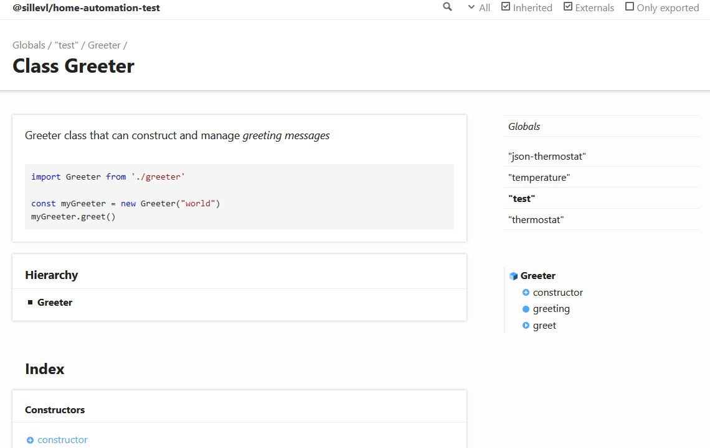
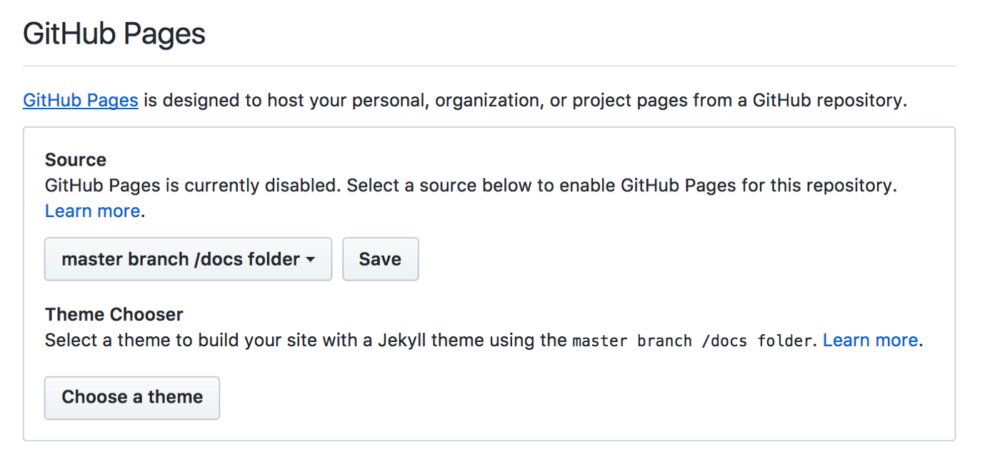

# Documentation Generation

## Documentation

When building libraries or any software, it is helpful to have some documentation
about the code and implementation. Getting this documentation is not difficult.
There exists tools that can automatically generate documentation only by providing it
with the source code.

Here we will take a look on how to generate this documentation, enhance it, and publish
it on GitHub.

## Example

Lets take for example the following class.

```ts
export default class Greeter {

  greeting: string;

  constructor(message: string) {
      this.greeting = message;
  }

  public greet(): string {
      return "Hello, " + this.greeting;
  }
}
```

Although this is enough for the documenation generation tools it is alway wise and
recommended to add some extra information as well. This is easy. Just add some comment
blocks in your code and you are ready.

## Enriching it with some text and examples

```ts
/**
 * Greeter class that can construct and manage _greeting messages_
 *
 * ```ts
 * import Greeter from './greeter'
 *
 * const myGreeter = new Greeter("world")
 * myGreeter.greet()
 * ```
 *
 */
export default class Greeter {

  /**
   * Property that contains the message to manage
   */
  greeting: string;

  /**
   * Create a new Greeter instance
   * 
   * @param message Message that will be managed by this Greeter instance
   */
  constructor(message: string) {
      this.greeting = message;
  }

  /**
   * Get the constructed message
   *  
   * @return An enriched string containing the greeter message
   */
  public greet(): string {
      return "Hello, " + this.greeting;
  }
}
```

The block comment that is right above a class, function, property,... will be joined
in the generated documentation.

### Markdown

You can use Markdown in these block comments. This enables you to add code examples and more

```ts
/**
 * Greeter class that can construct and manage _greeting messages_
 *
 * ```ts
 * import Greeter from './greeter'
 *
 * const myGreeter = new Greeter("world")
 * myGreeter.greet()
 * ```
 *
 */
```

### Annotations

To add some more semantics you can use 'annotations' in the block comments.
Some of the most used annotations are:

* `@param`: Add descriptions about function or method parameters
* `@return`: Add descriptions about return values

Examples:

```ts
/**
  * Create a new Greeter instance
  * 
  * @param message Message that will be managed by this Greeter instance
  */
constructor(message: string) {
    this.greeting = message;
}
```

```ts
/**
  * Get the constructed message
  *  
  * @return An enriched string containing the greeter message
  */
public greet(): string {
    return "Hello, " + this.greeting;
}
```

### Types

Some automatic documentation generation tools need more annotations to handle types
and such. This is not needed with TypeScript as all the type information is already
defined in the language itself.

## Generating the documentation

We are now ready to generate the documentation website that will contain all the docs
written in the code and comment blocks.

First we need to install a tool to generate the docs. In this example we will make use
[TypeDoc](https://typedoc.org/).

Simply install it with:

```bash
npm install typedoc
```

You can install it globally with `npm install -g typedoc` to use it directly in the CLI,
but to have it as a projects dependency it is better to use `npm scripts`. Just add
the following in your `package.json` in the `scripts` object:

```json
  "scripts": {
    "docs": "typedoc"
  },
```

You can now generate the documentation everywhere simply by running the npm command:

```bash
npm run docs
```

This will create a `./docs` directory containing a HTML website. Open this directory and click
on the `index.html` file to visit the website.



Pretty cool, uh? TypeDoc works perfectly.

Notice that TypeDoc will integrate your `README.md` file automatically as well.

## Hosting it on GitHub Pages

Now that we have our website containing the documentation, it is time to publish it.
An easy way to publish it is by using GitHub Pages. This is free and can host any kind of
static web content.

Commit your `./docs` folder, push it to GitHub. Then go to the GitHub repository in
the browser and go to Settings > GitHub Pages, select `master branch/docs folder` and
click **save**.



Then a link should appear with your documentation website. It is now **online**.
